# Call of Duty Weapon Knowledgebase Structure Diagram

```mermaid
graph TB
    subgraph "Call of Duty Weapon Knowledgebase"

        subgraph "Core Facts Database"
            W[Weapons Database<br/>121 weapons across 18 games]
            A[Attachments Database<br/>49 attachments across 8 categories]
            M[Game Mechanics<br/>26 mechanics across 5 types]
            P[Progression Chains<br/>28 unlock relationships]
        end

        subgraph "Weapon Classification System"
            W --> WT[Weapon Types<br/>assault_rifle, sniper_rifle<br/>submachine_gun, shotgun<br/>marksman_rifle, battle_rifle<br/>pistol, light_machine_gun]
            W --> WE[Era Classification<br/>Classic: 2003-2017<br/>Modern: 2007-2019<br/>Advanced: 2014-2016]
            W --> WR[Role Classification<br/>Primary/Secondary<br/>Close Quarters/Long Range<br/>Automatic Weapons]
        end

        subgraph "Attachment System"
            A --> AT[Attachment Types<br/>Optics, Barrels, Stocks<br/>Underbarrels, Magazines<br/>Muzzles, Lasers, Perks]
            A --> AE[Effects System<br/>Damage Boost, Accuracy<br/>Recoil Reduction, Stealth<br/>Range Enhancement]
            A --> AC[Compatibility Matrix<br/>weapon_attachment/3<br/>Rating System 1-5]
        end

        subgraph "Game Mechanics Framework"
            M --> MT[Mechanic Types<br/>Progression, Unlock<br/>Modification, Gameplay<br/>Economy]
            M --> MG[Game Applicability<br/>Classic Games<br/>Modern Games<br/>Advanced Games]
        end

        subgraph "Recursive Rule Engine"
            P --> RU[Unlock Progression<br/>can_unlock_eventually/2<br/>unlock_chain/2]
            P --> RD[Depth Analysis<br/>progression_depth/2<br/>longest_chain_from/2]
            P --> RA[Attachment Chains<br/>attachment_unlock_chain/2<br/>can_unlock_attachment_eventually/2]
        end

        subgraph "Query Interface Layer"
            QS[Basic Queries<br/>gun_type/2, gun_damage/2<br/>high_damage_guns/1<br/>fast_firing_guns/1]
            QC[Classification Queries<br/>modern_era_guns/1<br/>primary_weapon/1<br/>close_quarters_weapon/1]
            QA[Attachment Queries<br/>compatible_attachments/2<br/>damage_boosting_attachments/1<br/>stealth_attachments/1]
            QO[Optimization Queries<br/>optimal_damage_build/2<br/>stealth_build/2<br/>versatile_weapons/1]
        end

        subgraph "Advanced Analysis"
            AS[Statistical Analysis<br/>count_weapons_by_type/2<br/>most_common_weapon_type/1<br/>unique_ammo_weapons/2]
            AO[Build Optimization<br/>best_close_quarters_weapon/1<br/>well_supported_weapons/1<br/>recommended_weapons_for_game/2]
        end

        W --> QS
        WT --> QC
        A --> QA
        AC --> QO
        RU --> QO
        QS --> AS
        QC --> AS
        QA --> AO
        QO --> AO

    end

    subgraph "Game Timeline Coverage"
        T1[Classic Era<br/>2003-2017<br/>COD 1, 2, WWII, Vanguard]
        T2[Modern Era<br/>2007-2019<br/>MW Series, Black Ops]
        T3[Advanced Era<br/>2014-2024<br/>AW, IW, BO3-6, MW19-23]

        WE --> T1
        WE --> T2
        WE --> T3
    end

    style W fill:#e1f5fe
    style A fill:#f3e5f5
    style M fill:#e8f5e8
    style P fill:#fff3e0
    style QS fill:#fce4ec
    style QC fill:#fce4ec
    style QA fill:#fce4ec
    style QO fill:#fce4ec
    style AS fill:#e0f2f1
    style AO fill:#e0f2f1
```

## System Architecture Overview

### Data Layer (Facts)

- **Weapons Database**: 121 weapon facts with attributes (type, ammo, damage, fire rate, game)
- **Attachments Database**: 49 attachment facts with effects and stat modifiers
- **Game Mechanics**: 26 mechanics categorized by type and game applicability
- **Progression Chains**: 28 unlock relationships for recursive analysis

### Logic Layer (Rules)

- **Classification Rules**: Weapon categorization by type, era, and role
- **Recursive Rules**: Progression analysis and chain generation
- **Compatibility Rules**: Attachment-weapon matching and optimization
- **Analysis Rules**: Statistical analysis and build recommendations

### Interface Layer (Predicates)

- **30+ query predicates** for comprehensive knowledge access
- **Multiple complexity levels**: Basic facts to advanced analysis
- **Optimization algorithms**: Best builds and weapon recommendations
- **Statistical tools**: Counting, categorization, and trend analysis

### Coverage Scope

- **18 Call of Duty games** spanning 21 years (2003-2024)
- **8 weapon types** with extended classification
- **8 attachment categories** with compatibility matrix
- **5 game mechanic types** across different eras
