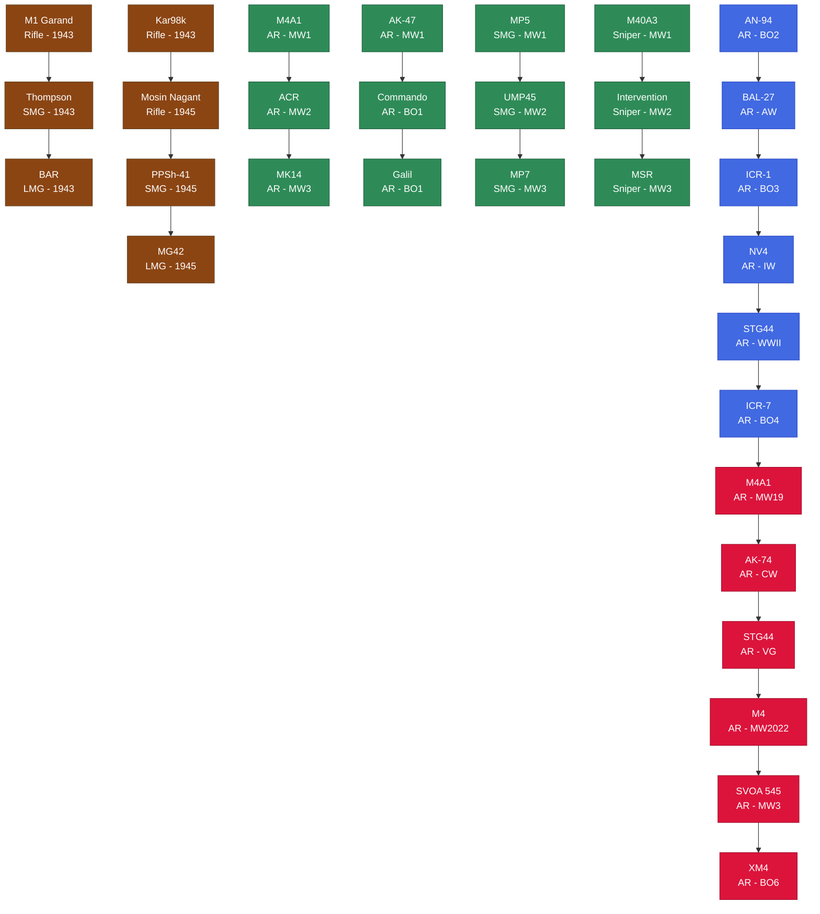

# Call of Duty Weapon Family Tree

This diagram shows the progression relationships between weapons and attachments in the Call of Duty weapon knowledgebase.

## Weapon Progression Family Tree

## Attachment Progression Family Tree

```mermaid
graph TD
    %% Optic Progression
    Red_Dot[Red Dot Sight<br/>Basic Optic] --> ACOG[ACOG Scope<br/>Long Range]
    ACOG --> Thermal[Thermal Scope<br/>Advanced Vision]

    %% Underbarrel Progression
    Foregrip[Foregrip<br/>Recoil Control] --> Bipod[Bipod<br/>Stability Support]

    %% Muzzle Progression
    Suppressor[Suppressor<br/>Stealth] --> Compensator[Compensator<br/>Recoil Reduction]

    %% Extended chains showing evolution
    Iron_Sights[Iron Sights<br/>Default] --> Red_Dot
    Red_Dot --> Reflex[Reflex Sight<br/>Quick ADS]
    Red_Dot --> Holo[Holographic Sight<br/>Wide View]
    ACOG --> Variable[Variable Zoom<br/>Flexible Range]

    %% Barrel Evolution
    Standard_Barrel[Standard Barrel<br/>Default] --> Extended[Extended Barrel<br/>Range Boost]
    Extended --> Heavy[Heavy Barrel<br/>Damage Boost]
    Standard_Barrel --> Light[Lightweight Barrel<br/>Mobility]
    Standard_Barrel --> Suppressed[Suppressed Barrel<br/>Stealth + Range]

    %% Magazine Evolution
    Standard_Mag[Standard Magazine<br/>Default] --> Extended_Mag[Extended Magazine<br/>+50% Capacity]
    Standard_Mag --> Fast_Mag[Fast Magazine<br/>Quick Reload]
    Extended_Mag --> Drum[Drum Magazine<br/>High Capacity]
    Fast_Mag --> Dual_Mag[Dual Magazine<br/>Versatile Reload]

    %% Stock Evolution
    Standard_Stock[Standard Stock<br/>Default] --> Tactical[Tactical Stock<br/>Stability]
    Tactical --> Precision[Precision Stock<br/>Accuracy]
    Standard_Stock --> Light_Stock[Lightweight Stock<br/>Mobility]
    Standard_Stock --> Heavy_Stock[Heavy Stock<br/>Recoil Control]
    Light_Stock --> Skeleton[Skeleton Stock<br/>ADS Speed]

    %% Styling for attachment types
    classDef opticStyle fill:#FFD700,stroke:#FFA500,color:#000
    classDef barrelStyle fill:#708090,stroke:#2F4F4F,color:#fff
    classDef stockStyle fill:#8B4513,stroke:#654321,color:#fff
    classDef magazineStyle fill:#32CD32,stroke:#228B22,color:#000
    classDef muzzleStyle fill:#FF6347,stroke:#DC143C,color:#fff
    classDef underbarrelStyle fill:#9370DB,stroke:#663399,color:#fff

    %% Apply styles
    class Iron_Sights,Red_Dot,ACOG,Thermal,Reflex,Holo,Variable opticStyle
    class Standard_Barrel,Extended,Heavy,Light,Suppressed barrelStyle
    class Standard_Stock,Tactical,Precision,Light_Stock,Heavy_Stock,Skeleton stockStyle
    class Standard_Mag,Extended_Mag,Fast_Mag,Drum,Dual_Mag magazineStyle
    class Suppressor,Compensator muzzleStyle
    class Foregrip,Bipod underbarrelStyle
```

## Weapon Type Family Classification

```mermaid
graph TD
    %% Root of weapon family
    COD_Weapons[Call of Duty Weapons<br/>1943-2024]

    %% Primary Categories
    COD_Weapons --> Primary[Primary Weapons]
    COD_Weapons --> Secondary[Secondary Weapons]

    %% Primary Weapon Types
    Primary --> Assault[Assault Rifles<br/>17 weapons]
    Primary --> Sniper[Sniper Rifles<br/>15 weapons]
    Primary --> LMG[Light Machine Guns<br/>8 weapons]
    Primary --> Shotguns[Shotguns<br/>12 weapons]
    Primary --> Battle[Battle Rifles<br/>9 weapons]
    Primary --> Marksman[Marksman Rifles<br/>8 weapons]

    %% Secondary Weapon Types
    Secondary --> Pistols[Pistols<br/>15 weapons]
    Secondary --> SMG[Submachine Guns<br/>20 weapons]

    %% Era Classifications
    COD_Weapons --> Classic_Era[Classic Era<br/>1943-1945]
    COD_Weapons --> Modern_Era[Modern Era<br/>2007-2011]
    COD_Weapons --> Advanced_Era[Advanced Era<br/>2014-2016]
    COD_Weapons --> Recent_Era[Recent Era<br/>2019-2024]

    %% Game Series Branches
    COD_Weapons --> MW_Series[Modern Warfare Series<br/>22 weapons]
    COD_Weapons --> BO_Series[Black Ops Series<br/>35 weapons]
    COD_Weapons --> Historical[Historical Games<br/>25 weapons]
    COD_Weapons --> Advanced_Games[Advanced Warfare Era<br/>15 weapons]

    %% Role-Based Classification
    Primary --> CQB[Close Quarters<br/>Combat Weapons]
    Primary --> Long_Range[Long Range<br/>Precision Weapons]
    Primary --> Versatile[Versatile<br/>All-Purpose Weapons]

    CQB --> Shotguns
    CQB --> SMG
    Long_Range --> Sniper
    Long_Range --> Marksman
    Long_Range --> Battle
    Versatile --> Assault

    %% Styling
    classDef rootStyle fill:#FF4500,stroke:#DC143C,color:#fff,font-weight:bold
    classDef categoryStyle fill:#4169E1,stroke:#2E4BC7,color:#fff
    classDef weaponTypeStyle fill:#228B22,stroke:#006400,color:#fff
    classDef eraStyle fill:#8B008B,stroke:#4B0082,color:#fff
    classDef seriesStyle fill:#FF8C00,stroke:#FF4500,color:#fff
    classDef roleStyle fill:#20B2AA,stroke:#008B8B,color:#fff

    class COD_Weapons rootStyle
    class Primary,Secondary categoryStyle
    class Assault,Sniper,LMG,Shotguns,Battle,Marksman,Pistols,SMG weaponTypeStyle
    class Classic_Era,Modern_Era,Advanced_Era,Recent_Era eraStyle
    class MW_Series,BO_Series,Historical,Advanced_Games seriesStyle
    class CQB,Long_Range,Versatile roleStyle
```

## Game Mechanics Evolution Tree

```mermaid
graph TD
    %% Root mechanics system
    Game_Mechanics[Call of Duty<br/>Game Mechanics]

    %% Core mechanic types
    Game_Mechanics --> Progression[Progression Systems]
    Game_Mechanics --> Unlock[Unlock Mechanisms]
    Game_Mechanics --> Modification[Weapon Modification]
    Game_Mechanics --> Gameplay[Gameplay Features]
    Game_Mechanics --> Economy[Economy Systems]

    %% Progression evolution
    Progression --> Basic_Leveling[Basic Leveling<br/>Classic Games]
    Basic_Leveling --> Weapon_Leveling[Weapon Leveling<br/>Modern Games]
    Weapon_Leveling --> Mastery[Weapon Mastery<br/>Challenge System]
    Mastery --> Battle_Pass[Battle Pass<br/>Seasonal Progression]

    Progression --> Prestige[Prestige System<br/>Classic Reset Mechanic]
    Prestige --> Blueprints[Weapon Blueprints<br/>Pre-configured Variants]

    %% Unlock system evolution
    Unlock --> Level_Based[Level-Based Unlocks<br/>Traditional System]
    Level_Based --> Challenge_Based[Challenge Unlocks<br/>Skill Gates]
    Challenge_Based --> Currency_Based[Currency Purchase<br/>Advanced Era]
    Level_Based --> Attachment_Prog[Attachment Progression<br/>Usage-Based]

    %% Modification system evolution
    Modification --> Create_Class[Create-a-Class<br/>Basic Customization]
    Create_Class --> Gunsmith[Gunsmith System<br/>Detailed Customization]
    Gunsmith --> Attachment_Tuning[Attachment Tuning<br/>Fine-Grained Control]
    Create_Class --> Variants[Weapon Variants<br/>Statistical Differences]

    %% Gameplay features
    Gameplay --> Basic_Combat[Basic Combat<br/>Shoot & Reload]
    Basic_Combat --> Advanced_Combat[Advanced Combat<br/>Tactical Elements]
    Advanced_Combat --> Modern_Combat[Modern Combat<br/>Movement Integration]

    Basic_Combat --> Weapon_Swap[Weapon Swapping]
    Advanced_Combat --> Reload_Cancel[Reload Canceling]
    Advanced_Combat --> Tactical_Reload[Tactical Reloading]
    Modern_Combat --> Weapon_Mount[Weapon Mounting]
    Modern_Combat --> Slide_Cancel[Slide Canceling]

    %% Economy evolution
    Economy --> Simple[No Economy<br/>Classic Games]
    Simple --> Salvage[Salvage System<br/>Material-Based]
    Simple --> Direct_Purchase[Direct Purchase<br/>Microtransactions]
    Salvage --> Loot_Boxes[Loot Box System<br/>RNG Rewards]
    Direct_Purchase --> Trading[Weapon Trading<br/>Player Exchange]

    %% Era indicators
    Game_Mechanics --> Classic_Mechanics[Classic Era<br/>2003-2011]
    Game_Mechanics --> Modern_Mechanics[Modern Era<br/>2012-2018]
    Game_Mechanics --> Advanced_Mechanics[Advanced Era<br/>2019-2024]

    %% Styling
    classDef rootStyle fill:#FF4500,stroke:#DC143C,color:#fff,font-weight:bold
    classDef categoryStyle fill:#4169E1,stroke:#2E4BC7,color:#fff
    classDef evolutionStyle fill:#228B22,stroke:#006400,color:#fff
    classDef modernStyle fill:#FFD700,stroke:#FFA500,color:#000
    classDef advancedStyle fill:#9370DB,stroke:#663399,color:#fff
    classDef eraStyle fill:#DC143C,stroke:#A0102A,color:#fff

    class Game_Mechanics rootStyle
    class Progression,Unlock,Modification,Gameplay,Economy categoryStyle
    class Basic_Leveling,Level_Based,Create_Class,Basic_Combat,Simple evolutionStyle
    class Weapon_Leveling,Challenge_Based,Gunsmith,Advanced_Combat,Salvage modernStyle
    class Battle_Pass,Currency_Based,Attachment_Tuning,Modern_Combat,Loot_Boxes advancedStyle
    class Classic_Mechanics,Modern_Mechanics,Advanced_Mechanics eraStyle
```

## Legend

### Weapon Progression Colors

- 🟤 **Classic Era (1943-1945)**: WWII-themed weapons
- 🟢 **Modern Era (2007-2011)**: Original Modern Warfare trilogy
- 🔵 **Advanced Era (2012-2016)**: Future warfare games
- 🔴 **Recent Era (2019-2024)**: Latest generation games

### Attachment Categories

- 🟡 **Optics**: Sighting systems and scopes
- ⚫ **Barrels**: Weapon barrel modifications
- 🟤 **Stocks**: Weapon stability and handling
- 🟢 **Magazines**: Ammunition and reload systems
- 🔴 **Muzzles**: Barrel-end attachments
- 🟣 **Underbarrel**: Grip and support attachments

This family tree represents the evolution and relationships within the Call of Duty weapon ecosystem, showing how weapons, attachments, and game mechanics have evolved across 21 years of franchise history.
